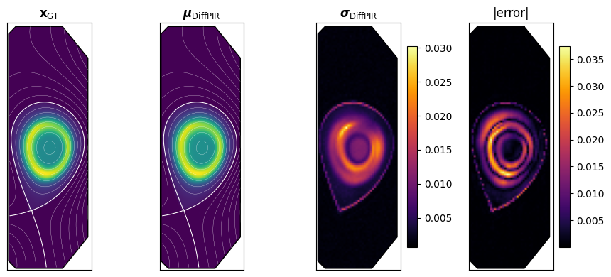

# plasma_diffusion

**Diffusion priors for plasma tomography** — Bayesian data-driven reconstruction of
plasma emissivity profiles from tomographic measurements, using diffusion models as
learned priors.

Companion code for:

> D. Hamm\*, Y. Haouchat\*, C. Theiler, and M. Unser,
> *"Diffusion Priors for Plasma Tomography: Bayesian Data-Driven Methods Applied to
> SXR Reconstruction"*
> (\*equal contribution — EPFL Swiss Plasma Center & Biomedical Imaging Group)

<p align="center">
  
</p>

Plasma emissivity reconstruction is a severely ill-posed, sparse-view inverse problem
`y = T x + noise`. This repository learns an expressive prior over emissivity profiles
with a **denoising diffusion model** (DDPM) trained on realistic synthetic phantoms,
then performs **posterior sampling** with the [DiffPIR](https://arxiv.org/abs/2305.08995)
algorithm — yielding both a reconstruction (posterior mean) and a meaningful,
error-correlated uncertainty map (pixel-wise posterior std). The prior is decoupled
from the reconstruction: one trained checkpoint serves **any** diagnostic geometry
without retraining. For strongly under-determined configurations, the
equilibrium-informed **DiffRD** variant augments the sampler with anisotropic
reaction-diffusion regularization along magnetic flux surfaces.

## Installation

```bash
git clone <this-repo>
cd plasma_diffusion
pip install -e .
```

Requirements: Python ≥ 3.10, PyTorch, NumPy, SciPy, Matplotlib, PyWavelets, tqdm
(scikit-image is used by the tutorial for metrics). A GPU is recommended but not
required.

Optional: [`pyxu-diffops`](https://github.com/pyxu-org/pyxu-diffops) is only needed to
*build* anisotropic RD operators for new equilibria (`build_rd_operator`); a
precomputed operator for the tutorial ships in `data/`.

## Quick start

```python
import numpy as np
import plasma_diffusion as pdiff

model = pdiff.load_pretrained("data/prior_sxr.pth", device="cuda")
schedule = pdiff.build_schedule(device="cuda")

A = np.load("data/geometry_sxr.npy")          # SXR geometry matrix (100 x 4800)
A = A / A.max()
x = np.load("data/phantoms_example.npy")[0]   # a ground-truth phantom (120 x 40)
y = A @ x.ravel() + 0.05 * np.random.randn(A.shape[0])

posterior, _, _ = pdiff.sample_posterior_diffpir(
    model, schedule, A, y, num_samples=50, sigma_y=0.05, lambda_=100, zeta=0.8,
)
mean = posterior.mean(dim=0)[0].cpu().numpy()   # reconstruction
std = posterior.std(dim=0)[0].cpu().numpy()     # uncertainty map
```

**→ Start with [`tutorial.ipynb`](tutorial.ipynb)**, which reproduces the full
pipeline of the paper on bundled example data (~8 MB): prior sampling, DiffPIR
reconstruction of a phantom with uncertainty quantification, the DiffRD variant, and
reconstruction of experimental data from TCV shot 85270.

## Repository structure

```
plasma_diffusion/
├── tutorial.ipynb            end-to-end walkthrough (start here)
├── plasma_diffusion/
│   ├── model.py              TinyUNet noise predictor + checkpoint loading
│   ├── diffusion.py          DDPM schedule, DDIM updates
│   ├── sampling.py           sample_prior, sample_posterior_diffpir (+DiffRD), DPS
│   ├── training.py           DDPM training loop and CLI
│   ├── data.py               amplitude normalization, noise estimation
│   ├── experimental.py       TCV shot-file preprocessing (equilibria, measurements)
│   ├── rd.py                 anisotropic RD operator build/save/load
│   └── plotting.py           profile plots on the TCV cross-section
└── data/
    ├── prior_sxr.pth         pretrained diffusion prior (trained on synthetic profiles)
    ├── geometry_sxr.npy      RADCAM SXR geometry matrix (100 lines of sight)
    ├── phantoms_example.npy  3 test phantoms with their equilibria (psi_example.npy)
    ├── y_train_sxr.npy       training-set measurements (for amplitude normalization)
    ├── rd_operator_example.npz  precomputed anisotropic operator for DiffRD
    └── shot_85270.mat        one experimental TCV shot (SXR measurements + LIUQE)
```

## Training your own prior

The bundled checkpoint was trained on ~10⁵ synthetic emissivity phantoms built from
magnetic equilibria of TCV discharges. To train on your own profiles (`.npy` files of
shape `(120, 40)`):

```bash
python -m plasma_diffusion.training --data-glob "path/to/profiles/*.npy" \
    --epochs 2000 --batch-size 512 --out checkpoints/
```

Because learning and reconstruction are decoupled, the resulting checkpoint can be
plugged into any forward model — including other diagnostics (DMPX, Pilatus) — by
simply passing the corresponding geometry matrix to the samplers.

## Citation

```bibtex
@article{hamm2026diffusion,
  title   = {Diffusion Priors for Plasma Tomography: Bayesian Data-Driven
             Methods Applied to SXR Reconstruction},
  author  = {Hamm, Daniele and Haouchat, Youssef and Theiler, Christian
             and Unser, Michael},
  year    = {2026},
}
```

## Acknowledgements

This work was supported in part by the Swiss National Science Foundation and carried
out within the framework of the EUROfusion Consortium, via the Euratom Research and
Training Programme (Grant Agreement No 101052200 — EUROfusion), funded by the Swiss
State Secretariat for Education, Research and Innovation (SERI).

## License

[MIT](LICENSE)
